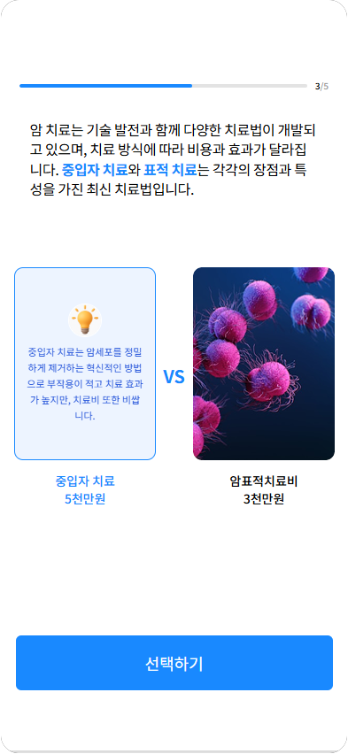
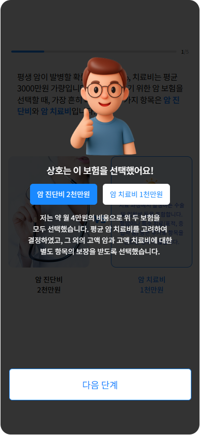
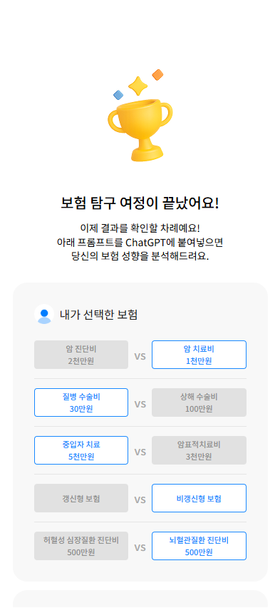

# 🛡️ 보험 온보딩 월드컵 (InsurGuide)

> 5라운드 1:1 선택 게임을 통해 나만의 보험 성향을 발견하고, AI 프롬프트로 맞춤형 분석을 받아보세요!


<div style="display: flex; justify-content: space-between; gap: 10px;">
  
  
  
</div>

## 🎯 프로젝트 소개

**보험 온보딩 월드컵**은 복잡한 보험 개념을 게임화를 통해 쉽고 재미있게 이해할 수 있도록 돕는 웹 애플리케이션입니다. 사용자는 5라운드에 걸쳐 다양한 보험 시나리오를 선택하며, 최종적으로 자신의 성향에 맞는 GPT 프롬프트를 받게 됩니다.

### 주요 특징

- **직관적인 게임 인터페이스**: 카드 뒤집기 애니메이션과 함께하는 선택형 게임
- **성향 기반 분석**: 선택 패턴을 분석하여 맞춤형 GPT 프롬프트 제공
- **실시간 사용자 분석**: Firebase Analytics를 통한 상세한 사용자 행동 추적


## 🚀 배포
- **배포 URL**: [https://insurguide.app](https://insurguide.app) _(예정)_


## 🛠 기술 스택

### Frontend
- **React 18.2.0** + **TypeScript 4.9.3**
- **Vite 4.1.0** 
- **TailwindCSS 3.2.0** 

### Analytics & Monitoring
- **Firebase Analytics 9.17.0** 

### Deployment
- **Docker** + **Nginx** 
- **AWS EC2** 

## 📋 게임 플로우


## 🔥 Firebase 이벤트 추적

| 이벤트명 | 설명 | 파라미터 |
|---------|------|----------|
| game_start | 게임 시작 | `{uuid}` |
| option_selected | 카드 선택 | `{questionId, selectedOption, round}` |
| card_flip | 카드 뒤집기 | `{cardId, flipDuration}` |
| result_viewed | 결과 페이지 진입 | `{roundCount, completionTime}` |
| prompt_copied | 프롬프트 복사 | `{promptLength}` |
| share_clicked | 공유 버튼 클릭 | `{shareMethod}` |
| replay_game | 다시하기 | `{previousScore}` |
| exit_mid_game | 중간 이탈 | `{exitRound, sessionDuration}` |

## 🏗 주요 프로젝트 구조

```
src/
├── components/    # UI 컴포넌트
├── pages/         # 주요 페이지
├── hooks/         # 게임 로직 & Firebase 연동
├── data/          # 질문, 프롬프트 템플릿
└── types/         # TypeScript 타입 정의
```

## 📊 주요 기능

- **질문 풀 관리**: 독립적인 10개 질문 중 5개 랜덤 선택
- **카드 인터랙션**: 3D 뒤집기 애니메이션 및 상세 정보 제공
- **카테고리 매핑**: 각 선택지의 카테고리 기반 성향 분석
- **프롬프트 생성**: 선택 패턴에 따른 맞춤형 GPT 프롬프트 제공
- **이탈률 분석**: 어느 지점에서 사용자가 이탈하는지 측정


## 👥 팀 정보

| 역할 | 이름 | 담당 업무 |
|------|------|-----------|
| **UX/UI 디자이너** | 혜민 | 디자인시스템, 인터랙션 설계, 사용자 경험 |
| **데이터 엔지니어** | 창배 | 질문 기획, 데이터 설계, 프롬프트 설계, 배포 |
| **프론트엔드 개발자** | 소연 | 화면 구성, 상태 관리, Firebase 연동 |

---

<br/>

**🛡️ 보험이 어려운 이유? 정보도 많고, 내 상황에 맞는 걸 찾기 어렵기 때문입니다.**
**보험 온보딩 월드컵은 그 시작을 조금 더 재미있고 직관적으로 만들어 보려는 실험입니다.**

Made with ❤️ by **휘모리팀**
